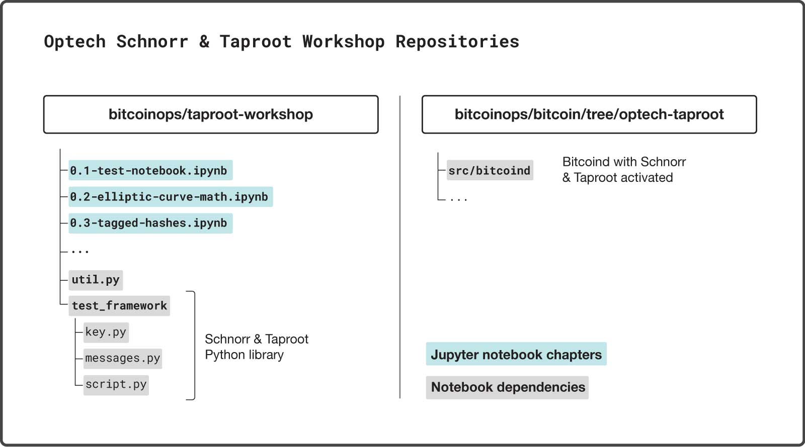

# taproot-workshop

This repo contains the Jupyter notebooks for Optech's [Schnorr/Taproot
workshops](https://bitcoinops.org/workshops/#taproot-workshop).

## Introduction

For the purposes of demonstrating the features of schnorr and taproot to the
Bitcoin developer community, we have developed an extended Python library on
top of Bitcoin Core's function test framework, which provides Python
classes and methods to build more sophisticated Taproot transactions and
various schnorr signature schemes for preliminary evaluation.

*Note: This Library is intended for demonstrative and educational purposes only.*

## Warning

Do not run test instances of bitcoind on the same machine that you store your
Bitcoin private keys. These notebooks shouldn't interfere with your
standard bitcoin data directory, but why risk it?

## Background

It will be useful to have some background on schnorr and taproot before running
through the exercises in this repository.

### Schnorr

- **[bip-0340](https://github.com/bitcoin/bips/blob/master/bip-0340.mediawiki)**:
  This technical document proposes a standard for 64-byte Schnorr signatures
  over the elliptic curve secp256k1.
- **[Taproot, and Schnorr, and SIGHASH_NOINPUT, oh
  my!](https://www.youtube.com/watch?v=YSUVRj8iznU)**: video
  about Taproot, Schnorr, and SIGHASH_NOINPUT by Pieter Wuille, author of the
  Schnorr/Taproot proposal. (Note: since the video SIGHASH_NOINPUT is no longer
  grouped with the taproot/schnorr soft fork proposal) ([transcript](https://diyhpl.us/wiki/transcripts/sf-bitcoin-meetup/2018-07-09-taproot-schnorr-signatures-and-sighash-noinput-oh-my/))
- **[Optech Executive Briefing The Next
  Softfork](https://www.youtube.com/watch?v=fDJRy6K_3yo)**: Optech's video
  presentation of the next proposed soft fork.

### Taproot

- **[bip-0341](https://github.com/bitcoin/bips/blob/master/bip-0341.mediawiki)**:
  This technical document proposes a new SegWit version 1 output type, with spending rules based on Taproot, Schnorr signatures, and Merkle branches.
- **[bip-0342](https://github.com/bitcoin/bips/blob/master/bip-0342.mediawiki)**: This technical document specifies the semantics of the initial scripting system under bip-0341.
- **[Bitcoin Optech’s Overview of the Taproot & Tapscript proposed BIPs](https://bitcoinops.org/en/newsletters/2019/05/14/#overview-of-the-taproot--tapscript-proposed-bips)**: Summary of bip-341 and bip-342.

### Output Descriptors

- **[Support for Output Descriptors in Bitcoin Core](https://github.com/bitcoin/bitcoin/blob/master/doc/descriptors.md)**:
  Since Bitcoin Core v0.17, there is support for output descriptors. This is a simple language which can be used to describe collections of output scripts.

## Running the notebooks

The notebooks can either be run in the cloud or in a local Jupyter environment.

### Google Colab cloud

Google Colab is a Jupyter notebook environment that requires no setup, is free to use and runs entirely in the Google cloud.
Running the Optech Schnorr/Taproot workshop in Google Colab requires you to login with your Google account.
The Colab environment disconnects your runtime after 30 minutes of inactivity and has a maximum session length of 12 hours.
Don't forget to save your progress.
You can have multiple runtimes and notebooks open at the same time.


The following notebooks are located in the [Colab](https://github.com/bitcoinops/taproot-workshop/tree/Colab) branch of this repository and are modified to run on Google Colab.

- [`0.1-test-notebook.ipynb` on Colab](https://colab.research.google.com/github/bitcoinops/taproot-workshop/blob/Colab/0.1-test-notebook.ipynb)
- [`0.2-elliptic-curve-math.ipynb` on Colab](https://colab.research.google.com/github/bitcoinops/taproot-workshop/blob/Colab/0.2-elliptic-curve-math.ipynb)
- [`0.3-tagged-hashes.ipynb` on Colab](https://colab.research.google.com/github/bitcoinops/taproot-workshop/blob/Colab/0.3-tagged-hashes.ipynb)
- [`1.1-schnorr-signatures.ipynb` on Colab](https://colab.research.google.com/github/bitcoinops/taproot-workshop/blob/Colab/1.1-schnorr-signatures.ipynb)
- [`1.2-musig.ipynb` on Colab](https://colab.research.google.com/github/bitcoinops/taproot-workshop/blob/Colab/1.2-musig.ipynb)
- [`2.0-taproot-introduction.ipynb` on Colab](https://colab.research.google.com/github/bitcoinops/taproot-workshop/blob/Colab/2.0-taproot-introduction.ipynb)
- [`2.1-segwit-version-1.ipynb` on Colab](https://colab.research.google.com/github/bitcoinops/taproot-workshop/blob/Colab/2.1-segwit-version-1.ipynb)
- [`2.2-taptweak.ipynb` on Colab](https://colab.research.google.com/github/bitcoinops/taproot-workshop/blob/Colab/2.2-taptweak.ipynb)
- [`2.3-tapscript.ipynb` on Colab](https://colab.research.google.com/github/bitcoinops/taproot-workshop/blob/Colab/2.3-tapscript.ipynb)
- [`2.4-taptree.ipynb` on Colab](https://colab.research.google.com/github/bitcoinops/taproot-workshop/blob/Colab/2.4-taptree.ipynb)
- [`2.5-huffman.ipynb` on Colab](https://colab.research.google.com/github/bitcoinops/taproot-workshop/blob/Colab/2.5-huffman.ipynb)
- [`3.1-degrading-multisig-case-study.ipynb` on Colab](https://colab.research.google.com/github/bitcoinops/taproot-workshop/blob/Colab/3.1-degrading-multisig-case-study.ipynb)

### Local setup

The Optech Schnorr/Taproot workshop can be setup and run locally.
This section lists the necessary steps and requirements.

#### Clone this (bitcoinops/taproot-workshop) repository

```
$ git clone https://github.com/bitcoinops/taproot-workshop.git
```

#### Build a taproot-supporting bitcoind

These workbooks require a `bitcoind` with version 0.21 or later which supports schnorr and taproot.



If you do not already have the Bitcoin Core repo on your local machine, then clone it with:

```
$ git clone https://github.com/bitcoin/bitcoin.git
```

Note the path where you cloned the bitcoin repository and add it to
the `config.ini` file in your taproot-workshop repository. For example, set:

```
SOURCE_DIRECTORY=/Users/username/bitcoin
```

Build bitcoind locally. See the build documentation
(`build-xxxx.md`) in the [Bitcoin Core repository docs
directory](https://github.com/bitcoin/bitcoin/tree/master/doc) for additional
documentation on building bitcoind on
[Unix](https://github.com/bitcoin/bitcoin/blob/master/doc/build-unix.md),
[macOS](https://github.com/bitcoin/bitcoin/blob/master/doc/build-osx.md), or
[Windows](https://github.com/bitcoin/bitcoin/blob/master/doc/build-windows.md).

Note that these notebooks will make use of the `bitcoind` wallet and so when following the build instructions above, do *not* use the `--disable-wallet` flag.

No need to run `bitcoind` or download the mainchain or testnet blockchain. We will
run in regtest mode and spawn node instances via scripts.

#### Python 3

Verify you have python3 installed:

```
$ python3 --version
```

If not, you should install Python 3.

Linux:

```
$ sudo apt-get install python3
```

macOS (using [homebrew](https://brew.sh/)):

```
$ brew install python3
```

Windows:

- Install using [binary from
  python.org](https://www.python.org/downloads/windows/) as appropriate for
  your system

#### Python Dependencies

This workshop uses some Python dependencies, particularly `jupyter-notebook`. To
keep dependencies local to the project, you should create and activate a
virtual environment. You can skip this step if you're happy to install the
dependencies globally.

Make sure you are in your taproot-workshop repository folder.

```
$ python3 -m venv .venv && source .venv/bin/activate
```

(if you're using the `csh` or `fish` shells, replace `.venv/bin/activate` with
`.venv/bin/activate.csh` or `.venv/bin/activate.fish`)

Install dependencies:

```
$ pip3 install -r requirements.txt
```

Ensure jupyter notebook is installed:

```
$ jupyter notebook --version
```

Jupyter notebook is a handy tool which allow us to run python code directly in
an interactive document like this one. The workshop materials are built
directly with jupyter .ipynb files, which you can open once you have jupyter
installed.

Start jupyter notebook to see exercises:

```
$ jupyter notebook
```

Jupyter will start a notebook server in your terminal, and provide a link for
your browser from which you can interact with notebook files. If your browser
doesn't automatically open the notebook file explorer, click on the link
provided by jupyter notebook server in the terminal.

- Click on the `0.1-test-notebook.ipynb` notebook.
- Verify that `0.1-test-notebook.ipynb` passes all checks.

After you have run the 0.1 example exercises, please also run through the
0.2-elliptic-curve-math.ipynb and 0.3-tagged-hashes.ipynb notebooks and
exercises before the workshop.

Notebooks 1.x, 2.x, etc will be covered during the workshop. There is no need to
run through those beforehand.

Stop the current running jupyter session using Control-C in the terminal.

After you have finished your jupyter session, you can deactivate the Python
virtual environment with:

```
$ deactivate
```
