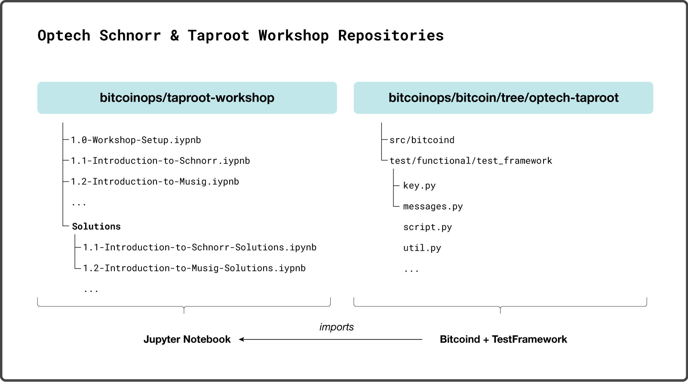

# taproot-workshop

This repo contains the Jupyter notebooks for Optech's [Schnorr/Taproot
workshops](https://bitcoinops.org/workshops/#taproot-workshop).

## Introduction

For the purposes of demonstrating the features of schnorr and taproot to the
Bitcoin developer community, we have developed an extended Python library on
top of Pieter Wuille's Taproot Bitcoin Core branch, which provides Python
classes and methods to build more sophisticated Taproot transactions and
various schnorr signature schemes for preliminary evaluation.

Our Taproot/Schnorr library is an extension of the Bitcoin python test
framework, located in the dedicated [Optech Bitcoin Taproot
Branch](https://github.com/bitcoinops/bitcoin/releases/tag/v0.1).

*Note: This Library is intended for demonstrative and educational purposes only.*

## Warning

Do not run test instances of bitcoind on the same machine that you store your
Bitcoin private keys. These notebooks shouldn't interfere with your
standard bitcoin data directory directory, but why risk it?

## Requirements

#### Build a taproot-supporting bitcoind

These workbooks require a `bitcoind` built from the [Optech taproot
branch, v0.1](https://github.com/bitcoinops/bitcoin/releases/tag/v0.1) which
supports schnorr and taproot. 



Clone the bitcoinops/bitcoin repository in a separate directory from this
taproot-workshop repository:

```
$ git clone https://github.com/bitcoinops/bitcoin
```

Note the path where you cloned the bitcoinops/bitcoin repository.

Checkout the Optech taproot branch, which is tagged as `v0.1`:

```
$ git checkout v0.1
```

Build the Optech Taproot branch of bitcoind locally. See the build documentation
(`build-xxxx.md`) in the [Bitcoin Core repository docs
directory](https://github.com/bitcoin/bitcoin/tree/master/doc) for additional
documentation on building bitcoind on
[Unix](https://github.com/bitcoin/bitcoin/blob/master/doc/build-unix.md),
[macOS](https://github.com/bitcoin/bitcoin/blob/master/doc/build-osx.md), or
[Windows](https://github.com/bitcoin/bitcoin/blob/master/doc/build-windows.md).

#### Python 3

Verify you have python3 installed:

```
$ python3 --version
```

If not, you should install Python 3.

Linux:

```
$ sudo apt-get install python3
```

macOS (using [homebrew](https://brew.sh/)):

```
$ brew install python3
```

Windows:

- Install using [binary from
  python.org](https://www.python.org/downloads/windows/) as appropriate for
  your system

#### Python Dependencies

This workshop uses some Python dependencies, particularly `jupyter-notebook`. To
keep dependencies local to the project, you should create and activate a
virtual environment. You can skip this step if you're happy to install the
dependencies globally:

```
$ python3 -m venv .venv && source .venv/bin/activate
```

Install dependencies:

```
$ pip3 install -r requirements.txt
```

Ensure Jupyter Notebook is installed:

```
$ jupyter notebook --version
```

Jupyter notebook is a handy tool which allow us to run python code directly in
an interactive document like this one. The workshop materials are built
directly with jupyter .ipynb files, which you can open once you have jupyter
installed.

Start Jupyter notebook to see exercises:

```
$ jupyter notebook
```

Jupyter will start a notebook server in your terminal, and provide a link for
your browser from which you can interact with notebook files. If your browser
doesn't automatically open the notebook file explorer, click on the link
provided by jupyter notebook server in the terminal.

- Click on the `0.1-test-notebook.ipynb` notebook.
- Verify that `0.1-test-notebook.ipynb` passes all checks.

Stop the current running Jupyter session using Control-C in the terminal.

After you have finished your Jupyter session, you can deactivate the Python
virtual environment with:

```
$ deactivate
```